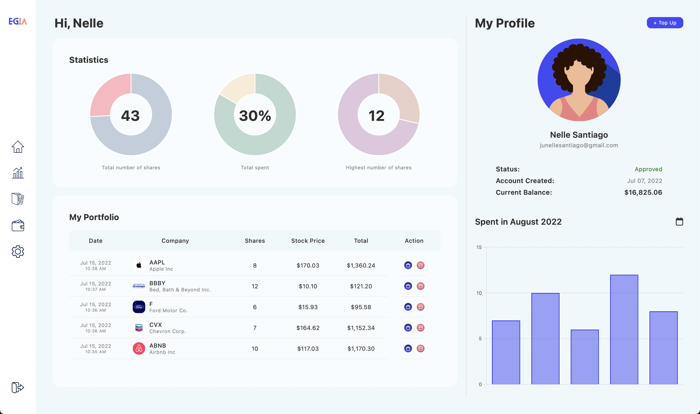

### ✨ [Stock App (Click to see live version)](http://egia-trading.herokuapp.com)

>> ###### *A Ruby on Rails application that simulates buy and sell of stocks.*
>> - Created a feature which allows users to receive emails about account confirmation, approval, and deletion via Devise and Mailjet.
>> - Implemented a transactions table to monitor transaction history made by users from buying and selling.
>> - Added a validation on user stocks controller to restrict admin from buying and selling stocks.
>> - Installed IEX gem, an API wrapper that allows to get the latest stock data.
>> - Installed chartkick gem for stock data presentation.
>> - Placed RSpec gem for model and system testing.

>> ###### **Sign in as admin**
>> - Email address: egiatrading@gmail.com
>> - Password: 1234567890

 

 

 

 

>> ###### Sources:
>> - Heartcombo's [Devise Tutorial](https://github.com/heartcombo/devise)
>> - Mailjet [Documentation](https://dev.mailjet.com)
>> - Ruby on Rails's [Guides](https://guides.rubyonrails.org/v6.1/)
>> - [RSpec Rails Gem](https://github.com/rspec/rspec-rails) for testing.
>> - [Chartkick Gem](https://chartkick.com) for stock data presentation.
>> - Images from [Canva](https://www.canva.com).
